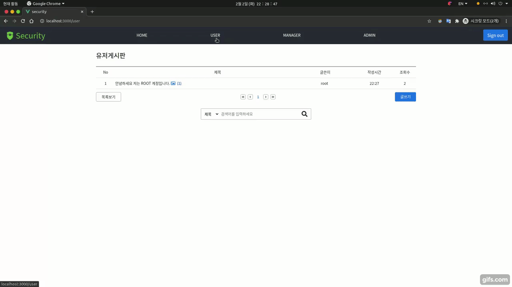
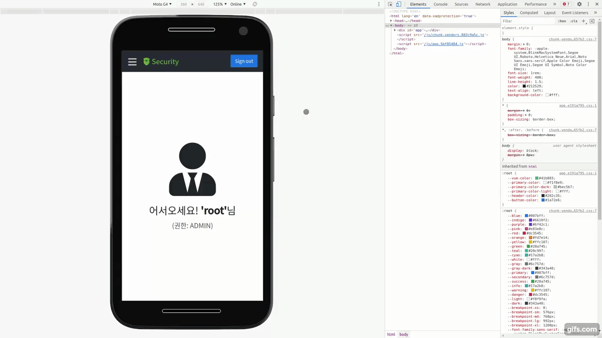
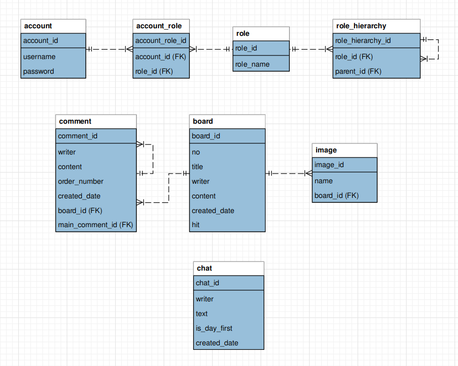

# security-project

## 개선된 프로젝트
이 프로젝트의 문제점을 개선하여 프로젝트를 다시 제작했다.   
개선된 프로젝트: https://github.com/yellowsunn/simpleforum

## 개요
* 스프링 시큐리티를 이용하여 DB와 연동한 커스텀한 인증, 인가 서비스를 제공한다.
  * Remember Me, CSRF 방지 토큰, 동시 세션 수 제한 기능 사용
    * 로그인 페이지에서 `로그인 상태 유지` 버튼을 클릭해서 로그인 하는 경우 Remeber Me 쿠키가 발급되고 세션이 만료되거나 웹브라우저가 종료된 경우에도 사용자를 기억한다.
    * 사용자는 1개의 세션만 접속할 수 있고, 이전에 접속했던 세션은 만료된다.
* 부가 기능으로 게시판, 실시간 채팅방, 사용자 관리 기능을 구현

* backend: `spring-boot`, frontend: `Vue.js`
  * 각각의 프로젝트는 Docker image로 배포함
    * https://hub.docker.com/r/yellowsunn/security-project-backend
    * https://hub.docker.com/r/yellowsunn/security-project-frontend

* 전체 서비스는 docker compose 명령어로 테스트 해볼 수 있다.
  ```bash
  git clone https://github.com/yellowsunn/security-project.git
  cd security-project
  docker-compose up
  ```
  
## Demo
</img><br/>
<br/>
</img><br/>
<br/>

* 주소: http://www.yellowsunn.com:3000/
  * 반응형 웹사이트로 제작

* 사용자 권한은 ADMIN > MANAGER > USER 순의 계층 구조를 가지고 있으며 사용자의 권한에 맞는 페이지만 접속할 수 있다.
  * 회원가입시 기본 권한은 USER다.
  * ADMIN 계정으로 사용자의 권한을 변경할 수 있다.

* 기본 ADMIN 계정 (이 계정은 수정,삭제가 불가능하다)
  * id: `root`
  * password: `yellowsunn`

## DB 테이블 구조도 
</img><br/>
* ### **사용자 관련 테이블**
  * **계정(account)**: 이름과 패스워드 정보를 가진다.
  * **권한(role)**: `role_name`으로 ADMIN, MANAGER, USER를 가지고 있다.
  * **권한 계층구조(role_hierarchy)**: `parent_id`로 부모 권한을 연결해서 계층구조를 형성
    * 권한이 USER의 경우 부모가 없으며 MANAGER는 부모가 USER, ADMIN은 부모가 MANAGER 이다. <br>
      따라서, 부모를 추적함으로써 부모의 권한까지 얻어낼 수 있다.
  * **계정&권한(account_role)**: 계정과 권한을 연결

* ### **게시판 관련 테이블**
  * **게시판(board)**: 게시글에 필요한 정보들을 가지고 있다.
  * **이미지(image)**: 게시글에 등록된 이미지 이름을 칼럼으로 가지고 있으며, 게시글이 삭제되는 경우 서버에 저장된 이미지 이름을 찾아 제거하는데 사용
  * **댓글(comment)**: 댓글을 구성하는 정보들을 가지고 있다.
    * `order_number`: 정렬을 위해 추가한 칼럼
    * `main_comment_id`: 작성된 댓글이 댓글의 댓글인 경우 메인이 되는 댓글에 연결한다.

* ### **채팅 관련 테이블**
  * **채팅(chat)**: 채팅을 작성한 작성자와 작성글, 작성시간 정보를 가지고 있다.
    * `is_day_first`: 하루 중 가장 처음으로 작성글은 값으로 true를 가진다. (날짜를 표현하기 위해 추가)
